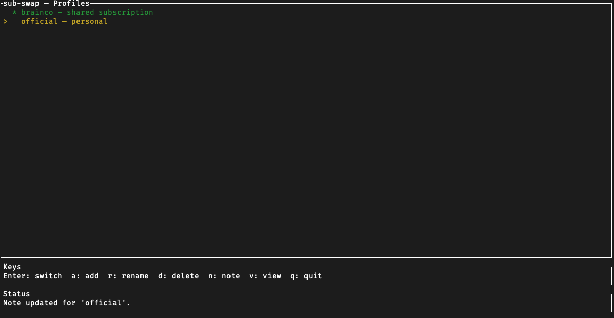

# sub-swap

Manage multiple Codex profiles from your terminal. Switch subscriptions, encrypt credentials at rest, and never manually juggle `~/.codex/` again.

<p align="center">
  
</p>

## Highlights

- **Instant profile switching** — swap `~/.codex/` credentials in one command
- **AES-256-GCM encryption** — inactive profiles encrypted at rest, key stored in your OS keychain
- **Interactive TUI** — full-screen terminal UI with keyboard shortcuts (or use the CLI)
- **Process guard** — blocks switching while Codex is running to prevent corruption
- **Strictly offline** — zero network dependencies, works fully air-gapped

## Installation

### Prebuilt Binaries

Download the latest binary for your platform from [GitHub Releases](https://github.com/minakoto00/sub-swap/releases).

**Always verify the SHA-256 checksum before running the binary:**

```bash
# Compare against the checksum published in the release notes
sha256sum sub-swap-<version>-<platform>.tar.gz
# or on macOS:
shasum -a 256 sub-swap-<version>-<platform>.tar.gz
```

Then install:

```bash
chmod +x sub-swap
sudo mv sub-swap /usr/local/bin/
```

### Build from Source

Requires a stable [Rust](https://rustup.rs/) toolchain.

```bash
git clone https://github.com/minakoto00/sub-swap.git
cd sub-swap
cargo build --release
# Binary at target/release/sub-swap
```

> **Linux note:** The `keyring` crate may require `libdbus-1-dev` and `libsecret-1-dev` (Debian/Ubuntu) depending on your desktop environment.

## Quick Start

**1. Save your current Codex profile**

```bash
sub-swap add work --note "work account"
```

**2. Set up a second profile**

Log into your other Codex account in `~/.codex/`, then:

```bash
sub-swap add personal --note "personal account"
```

**3. Switch between them**

```bash
sub-swap use work
```

**4. Or use the interactive TUI**

```bash
sub-swap
```

## Commands

| Command | Description |
|---------|-------------|
| `sub-swap list` | List all profiles (`-v` for details) |
| `sub-swap add <name>` | Import current `~/.codex/` as a new profile |
| `sub-swap add <name> --from <path>` | Import from a specific directory |
| `sub-swap use <name>` | Switch to a profile (`--force` to skip process guard) |
| `sub-swap rename <old> <new>` | Rename a profile |
| `sub-swap remove <name>` | Delete a stored profile |
| `sub-swap note <name> <text>` | Set or update a profile's note |
| `sub-swap decrypt <name>` | View decrypted profile contents (stdout only, never written to disk) |
| `sub-swap config show` | Show current settings |
| `sub-swap config set encryption <on\|off>` | Toggle encryption for stored profiles |

### TUI

Run `sub-swap` with no arguments to launch the interactive terminal UI.

**Keys:** `Enter` switch &middot; `a` add &middot; `r` rename &middot; `d` delete &middot; `n` note &middot; `v` view &middot; `q` quit

## Security

- **Encryption:** Inactive profiles are encrypted with AES-256-GCM. The active profile in `~/.codex/` remains plaintext (Codex requires this).
- **Key storage:** Your encryption key lives in the OS keychain (macOS Keychain, GNOME Keyring, Windows Credential Manager) — never on disk.
- **File permissions:** All files under `~/.sub-swap/` are created with mode `0600` (owner-only) on Unix.
- **Offline:** Zero network crates in the dependency tree, enforced by architectural tests.
- **Process guard:** `sub-swap use` detects running Codex processes and blocks switching to prevent credential corruption.

For the full threat model, see [docs/SECURITY.md](docs/SECURITY.md).

## Building & Testing

```bash
cargo test              # all tests (unit + integration)
cargo test --lib        # unit tests only
just validate           # fmt + clippy + test
```

## Documentation

| Doc | Purpose |
|-----|---------|
| [ARCHITECTURE.md](docs/ARCHITECTURE.md) | Module layout and dependency rules |
| [SECURITY.md](docs/SECURITY.md) | Encryption model and threat model |
| [TESTING.md](docs/TESTING.md) | Test infrastructure and recipes |

## License

Copyright (C) 2025 Juewei Dong

This project is licensed under the [GNU General Public License v3.0](LICENSE).
